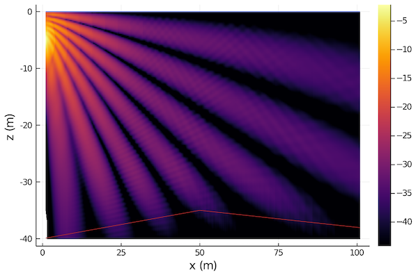

# Bellhop

```@meta
CurrentModule = UnderwaterAcoustics
```

!!! note

    To use Bellhop, you first need to install [OALIB Bellhop](http://oalib.hlsresearch.com/AcousticsToolbox/) and ensure you have `bellhop.exe` available on your `PATH`.

Bellhop is an interface to the [OALIB Bellhop](http://oalib.hlsresearch.com/AcousticsToolbox/) 2D Gaussian beam tracer. If `UnderwaterAcoustics` can find `bellhop.exe`, the Bellhop model will be available:

```julia-repl
julia> models()
3-element Array{Any,1}:
 PekerisRayModel
 RaySolver
 Bellhop
```

Additional options available with [`Bellhop`](@ref):

- `nbeams` -- number of beams used for ray tracing (default: auto)
- `minangle` -- minimum beam angle in radians (default: -80°)
- `maxangle` -- maximum beam angle in radians (default: 80°)
- `gaussian` -- geometric rays if `false`, Gaussian beams if `true` (default: `false`)
- `debug` -- if `true`, intermediate Bellhop files are made available for user inspection (default: `false`)

**Example:**

```julia
using UnderwaterAcoustics
using Plots

env = UnderwaterEnvironment(
  seasurface = Vacuum,
  seabed = SandyClay,
  ssp = SampledSSP(0.0:20.0:40.0, [1540.0, 1510.0, 1520.0], :smooth),
  bathymetry = SampledDepth(0.0:50.0:100.0, [40.0, 35.0, 38.0], :linear)
)
pm = Bellhop(env; gaussian=true)
tx = AcousticSource(0.0, -5.0, 1000.0)
rx = AcousticReceiverGrid2D(1.0, 0.1, 1000, -40.0, 0.2, 200)
x = transmissionloss(pm, tx, rx)
plot(env; receivers=rx, transmissionloss=x)
```



For more information on how to use the propagation models, see [Propagation modeling toolkit](@ref).
