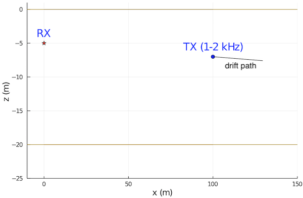
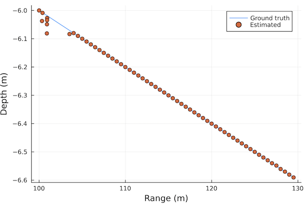
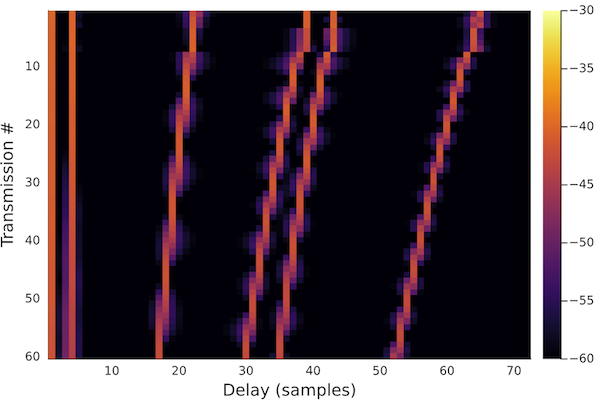

# Differentiable modeling

!!! note

    This tutorial is adapted from the example presented in the UComms 2020 webinar talk "[Underwater Acoustics in the age of differentiable and probabilistic programming](https://www.facebook.com/watch/live/?v=2473971036238315)".

## Problem statement

Let us consider a scenario where a drifting probe acoustically transmits its sensor data periodically to a static receiver. The initial position of the sensor is perfectly known, and so is the environment. But the path of the sensor as it drifts is not known, but we'd like to get an estimate of it from the received acoustic signal. Due to the high data rate requirements, the receiver uses an equalization technique that requires an accurate estimate of the channel impulse response. We want to generate that using a propagation model and an accurate estimate of the location of the probe.

The environment is an isovelocity channel with a constant depth of 20 m and known seabed parameters (relative density `ρ` = 1.5, relative soundspeed `c` = 1.2, and attenuation `δ` = 0.001). The probe uses a 1-2 kHz band for data transmission, and includes 101 pilots at 10 Hz spacing to aid with channel estimation. The transmission loss can be accurately measured at those pilot frequencies, since the transmit source level is assumed to be known, but phase information is assumed to be unavailable at each pilot.



## Dataset

To illustrate the idea, we generate a 60-transmission dataset with a linearly drifting path for the transmitter. Since we have an range-independent isovelocity environment, we can use the `PekerisRayModel` (otherwise we could use the `RaySolver`):

```julia
using UnderwaterAcoustics
using DataFrames

function 𝒴(θ)
  r, d, f, ρ, c, δ = θ
  env = UnderwaterEnvironment(seabed = RayleighReflectionCoef(ρ, c, δ))
  tx = AcousticSource(0.0, -5.0, f)
  rx = AcousticReceiver(r, -d)
  pm = PekerisRayModel(env, 7)
  transmissionloss(pm, tx, rx)
end

data = [(
    range=100.0 + 0.5t,
    depth=6.0 + 0.01t,
    pilots=[𝒴([100.0 + 0.5t, 6.0 + 0.01t, f, 1.5, 1.2, 0.001]) for f ∈ 1000.0:10.0:2000.0]
  ) for t ∈ 0.0:1.0:59.0]
data = DataFrame(vec(data))
```

## Gradient descent

In order to recover the drift path of the probe, we build a simple error model for the measured pilots. We initialize the model with the known starting location of the probe, and track the probe by minimizing the error through gradient descent.

Since our propagation model is differentiable, the gradient of the error can be automatically computed during the optimization using [`ForwardDiff.jl`](https://github.com/JuliaDiff/ForwardDiff.jl).

```julia
using ForwardDiff

# channel model for pilots
pilots(r, d) = [
  𝒴([r, d, f, 1.5, 1.2, 0.001]) for f ∈ 1000.0:10.0:2000.0
]

# gradient descent optimization
function chparams(data)
  history = []
  θ = [100.0, 6.0]    # known initial location
  η = [1e-4, 1e-6]    # learning rate
  for row ∈ eachrow(data)
    err(θ) = sum(abs2, pilots(θ[1], θ[2]) .- row.pilots)  # error model
    for i ∈ 1:100      # iterations of simple gradient descent
      θ .-=  η .* ForwardDiff.gradient(err, θ)
    end
    push!(history, (range=θ[1], depth=θ[2]))
  end
  DataFrame(history)
end

p = chparams(data)
```

Now that we have a path estimate, let's check it against the ground truth:

```julia
using Plots

plot(data.range, -data.depth; xlabel="Range (m)", ylabel="Depth (m)", label="Ground truth")
scatter!(p.range, -p.depth; label="Estimated")
```



We have a pretty good match!

## Impulse response estimation

Now we can generate the impulse response for each of the 60 received data packets:

```julia
# compute impulse response
function iresp(r, d)
  env = UnderwaterEnvironment(
    seabed = RayleighReflectionCoef(1.5, 1.2, 0.001)
  )
  tx = AcousticSource(0.0, -5.0, 1500.0)
  rx = AcousticReceiver(r, -d)
  pm = PekerisRayModel(env, 7)
  impulseresponse(arrivals(pm, tx, rx), 8000; reltime=true)[1:72]
end

ir = hcat([iresp(row.range, row.depth) for row ∈ eachrow(p)]...)'
heatmap(20*log10.(abs.(ir)); clim=(-60, -30), xlabel="Delay (samples)", ylabel="Transmission #", yflip=true)
```



We see the impulse response evolve over time as the probe drifts. This can then be used for channel equalization and to recover the transmitted data!
