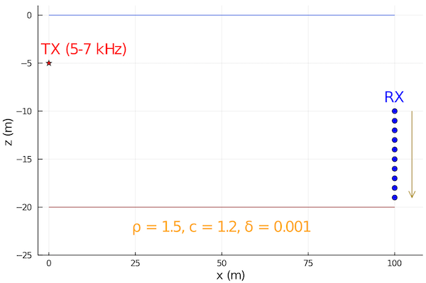
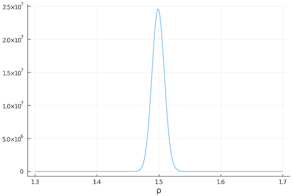
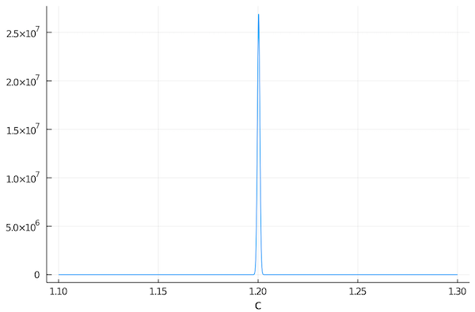
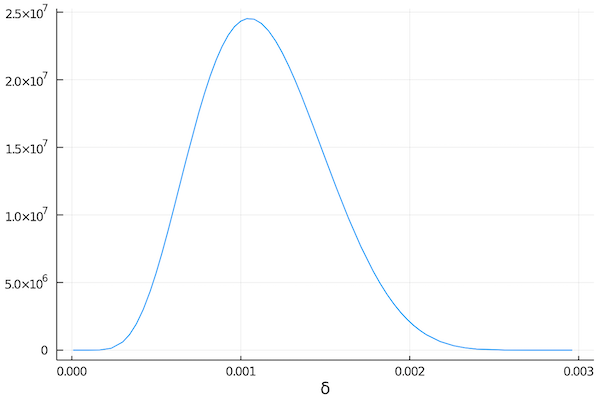

# Probabilistic modeling

!!! note

    This tutorial is based on the example presented in the UComms 2020 webinar talk "[Underwater Acoustics in the age of differentiable and probabilistic programming](https://www.facebook.com/watch/live/?v=2473971036238315)".

## Problem statement

Let us consider a geoacoustic inversion problem where we have a static omnidirectional broadband acoustic source transmitting in a 5-7 kHz band. A single omnidirectional receiver picks up the signal at a fixed range, but profiles the water column, and therefore makes transmission loss measurements at various depths. We would like to estimate seabed parameters from these transmission loss measurements.

## Dataset

To illustrate this idea, let us generate a synthetic dataset for a known set of seabed parameters (relative density `ρ` = 1.5, relative soundspeed `c` = 1.2, and attenuation `δ` = 0.001).

The environment is assumed to be an isovelocity and with a constant depth of 20 m. The source is at a depth of 5 m. The receiver is at a range of 100 m from the source, and makes measurements at depths from 10 to 19 m in steps of 1 m.



Since we have an range-independent isovelocity environment, we can use the `PekerisRayModel` (otherwise we could use the `RaySolver`):

```julia
using UnderwaterAcoustics
using DataFrames

function 𝒴(θ)
  r, d, f, ρ, c, δ = θ
  env = UnderwaterEnvironment(seabed = RayleighReflectionCoef(ρ, c, δ))
  tx = AcousticSource(0.0, -5.0, f)
  rx = AcousticReceiver(r, -d)
  pm = PekerisRayModel(env, 7)
  transmissionloss(pm, tx, rx)
end

data = [
  (depth=d, frequency=f, xloss=𝒴([100.0, d, f, 1.5, 1.2, 0.001]))
  for d ∈ 10.0:1.0:19.0, f ∈ 5000.0:100.0:7000.0
]
data = DataFrame(vec(data))
```

## Probabilistic model

We use some very loose uniform priors for `ρ`, `c` and `δ`, and etimate the transmission loss using the same model 𝒴, as used in the data generation, but without information on the actual seabed parameters. We assume that the measurements of transmission loss are normally distributed around the modeled transmission loss, with a covariance of 0.5 dB.

We define the probabilistic model as a [`Turing.jl`](https://github.com/TuringLang/Turing.jl) model:

```julia
using Turing

# depths d, frequencies f, transmission loss measurements x
@model function geoacoustic(d, f, x)
  ρ ~ Uniform(1.0, 3.0)
  c ~ Uniform(0.5, 2.5)
  δ ~ Uniform(0.0, 0.003)
  μ = [𝒴([100.0, d[i], f[i], ρ, c, δ]) for i ∈ 1:length(d)]
  x ~ MvNormal(μ, 0.5)
end
```

## Variational inference

Once we have the model defined, we can run Bayesian inference on it. We could either use MCMC methods from Turing, or variational inference. Since our model is differentiable, we choose to use the automatic differentiation variational inference (ADVI):

```julia
using Turing: Variational

q = vi(
  geoacoustic(data.depth, data.frequency, data.xloss),
  ADVI(10, 10000)
)
```

The returned `q` is a 3-dimensional posterior probability distribution over the parameters `ρ`, `c` and `δ`. We can estimate the mean of the distribution by drawing random variates and taking the sample mean:

```julia-repl
julia> mean(rand(q, 10000); dims=2)
3×1 Array{Float64,2}:
 1.4988686875663213
 1.200287830442071
 0.001139531366600336
```

We see that the esimtated parameter means for `ρ`, `c` and `δ` are quite close to the actual values used in generating the data.

We can also plot the conditional distributions of each parameter:

```julia-repl
using StatsPlots

plot(ρ -> pdf(q, [ρ, 1.2, 0.001]), 1.3, 1.7; xlabel="ρ")
plot(c -> pdf(q, [1.5, c, 0.001]), 1.1, 1.3; xlabel="c")
plot(δ -> pdf(q, [1.5, 1.2, δ]), 0.0, 0.003; xlabel="δ")
```




